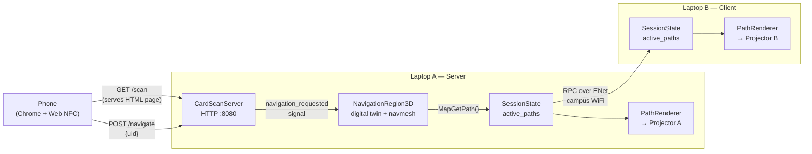

# Campus Navigation — Setup & Documentation

Real-time holographic navigation for SDU Cheese (Tek) building. Visitors scan a card at
a stand; projectors mounted around the building project animated path arrows
onto floors and walls guiding them to their destination.

---

## Hardware requirements

| Machine | Role | Projector |
|---|---|---|
| Laptop A | Server | Projector A |
| Laptop B | Client | Projector B |

Both laptops run the same Godot project. Role is selected on first launch and
saved locally -> no separate builds.

**Network:** Both machines must be on the same network.
Only the server's IP needs to be known in advance.

Windows -> PowerShell or cmd -> ipconfig
Linux -> Terminal -> ip -c address
MacOS -> Terminal -> ipconfig getifaddr en0

---

## First launch on both machines

On first launch, every machine steps through three stages in sequence.
Config is saved locally after each stage and is not repeated on subsequent runs.
If all config files already exist -> boot straight into the final scene.

### Stage 1 — Role panel

| Field | Server machine | Client machine |
|---|---|---|
| Role | Server | Client |
| Server IP | — | IP of Laptop A |

Press **Next**.

### Stage 2 — Projector panel (same for both machines)

Measure the physical projector position from a known reference point in the
digital twin (e.g. a wall corner or column that exists in both the real building
and the Godot scene). -> e.g. corner of corridor to door frame

| Field | How to measure |
|---|---|
| X | Horizontal distance (metres) from reference point |
| Y | Height (metres) from floor |
| Z | Depth (metres) from reference point |
| Heading | Horizontal rotation in degrees (0° = +Z axis in twin) |
| Pitch | Vertical tilt in degrees (negative = pointing down at floor) |
| Roll | Sideways tilt in degrees (0° for a level tripod head) |

These are rough starting values. Calibration (Stage 3) lets you fine-tune all six
live against the physical projection.

Press **Save & Launch** to proceed to calibration.

### Stage 3 — Calibration (same for both machines)

The calibration scene opens automatically after stage 2. It shows:

- **Left panel (laptop screen):** live preview of what the Camera3D sees inside
  the digital twin.
- **Right panel:** SpinBoxes for X, Y, Z (metres), Heading, Pitch, and Roll (degrees).
  Changes apply to the camera immediately.
- **Projector (second display):** a fullscreen borderless window showing the
  same camera view on the physical surface. If only one display is connected,
  the window appears on the same screen : useful for testing without a projector.

**Alignment procedure:**
1. Look at the physical projection on the floor/wall.
2. Adjust SpinBoxes until virtual building edges land on their physical
   counterparts (doorframes, wall corners, column edges).
3. Press **Save & Launch** — values are written to `user://projector.json` and
   the application launches into its final scene.

---

## Subsequent launches

Both config files are present : the application skips straight to the server or
client scene with no UI shown.

---

## Reconfiguration

| What changed | Action |
|---|---|
| Role or server IP | Delete `user://config.json` and relaunch |
| Projector moved or remounted | Delete `user://projector.json` and relaunch |

On Linux, `user://` resolves to:
`~/.local/share/godot/app_userdata/ProjectionMapping/`

On Windows, `user://` resolves to:
`%APPDATA%\Godot\app_userdata\ProjectionMapping`

On MacOS `user://` resolves to:
`~/Library/Application Support/Godot/app_userdata/ProjectionMapping`

On FreeBSD you're cooked.

---

## Config file reference

**`user://config.json`** — written by the role panel
```json
{ "role": "server" }
```
```json
{ "role": "client", "server_ip": "192.168.1.x" }
```

**`user://projector.json`** — written by the projector panel, same format on
every machine
```json
{ "x": 3.2, "y": 2.8, "z": 1.1, "heading": -42.0, "pitch": -58.0, "roll": 0.5 }
```

---

## Architecture overview



**Autoloads (on every peer):**

- `Network` : thin ENet wrapper; only place that touches
  `multiplayer.multiplayer_peer`
- `SessionState` : holds `active_paths` and `path_progress`; owns the RPC that
  replicates state from server to clients. Lives at `/root/SessionState` on all
  peers so Godot's multiplayer routing works correctly.

**Why RPCs are on SessionState, not on Server/Client:**
Godot routes RPCs by node path. Server.tscn root is `/root/Server`; Client.tscn
root is `/root/Client` — different paths, so cross-peer RPCs between them would
silently fail. Autoloads share the same path on all peers, which is why the RPC
lives there.

**Why no zone clipping:**
Each client renders the full path in 3D from its projector's camera perspective.
Godot's frustum culling discards anything outside that camera's view for free.
Where projectors overlap, both render : which should look seamless.

---

## Card reader MVP (phone + Web NFC)

For the MVP the phone acts as an unattended kiosk stander.
The server exposes a small HTTP server (`CardScanServer`, port 8080) alongside the
ENet game server (port 7777).

**Flow:**
1. Phone (Chrome on Android) is opened to `http://<server-ip>:8080/scan` and left at the stand.
2. Visitor taps the screen once to activate the NFC reader, then holds their campus card to the phone.
3. The browser reads the card's NFC UID and POSTs `{ uid }` to `/navigate`.
4. `Server.gd` looks up the UID in the schedule -> resolves the visitor's next scheduled classroom.
5. Path is computed via `NavigationServer3D.MapGetPath()`, written to `SessionState`, broadcast to clients -> projectors light up.
6. The phone UI shows the destination room for 3.5 s, then resets for the next visitor.

**One-time phone setup (required — Web NFC needs a secure context):**

1. Open `chrome://flags/#unsafely-treat-insecure-origin-as-secure`
2. Add `http://<server-ip>:8080` to the allowlist
3. Tap **Relaunch**

This flag must be set once per device per network. iOS does not support Web NFC.

### Card Registration (future)

We need to be able to associate different UID's with different users for the demo. At the very least we should grab group member's UIDs and associate them in-table with a predetermined destination. ((For proof of concept :3))

TODO:
- Pre-populate the `users` table with `(name, nfc_uid)` rows before the demo.
- The UID is printed to the Godot console on first scan so you can copy it.

---

## Projector mounting

Projectors are mounted on standard camera tripods. Each projector will have a
different position, heading, pitch, and roll depending on where its tripod is
placed and how the head is adjusted.

All four values are set in Stage 2 (rough physical measurement) and refined in
Stage 3 (live calibration against the physical projection surface).

To understand the specific projectors we are working with we calculated the 
angles of the light projection to make the pictrue sharp. By doing so we can 
make the communication between the cameras in the game engine and the 
projectors clear and thereby minimize places the picture will be misfitted. 
To do this we used the arctan formula: angle A = arctan(a/b) and angle 
B = arctan(b/a)

Since we know one angle to be 90 and the a side to be 129 and the b side to be 
37 the know values could simply be put into the formula mentioned:

A = arctan(129/37) = arctan(3.486) ≈ 74
Since we know that one angle is 90 we can just subtract A from 90 to find B:
B = 90-74 = 16

---

## Project structure

```
(Thanks, ramanthelan)
projection-mapping/
├── README.md                 : this file
├── project.godot
├── autoloads/
│   ├── Network.gd            : ENet wrapper (autoload)
│   └── SessionState.gd       : shared nav state + RPC (autoload)
├── scenes/
│   ├── bootstrap/
│   │   ├── Bootstrap.gd      : first-launch config + scene routing
│   │   └── Bootstrap.tscn
│   ├── server/
│   │   ├── Server.gd         : ENet host, path computation, card scan wiring
│   │   └── Server.tscn       : digital twin lives here
│   ├── client/
│   │   ├── Client.gd         : ENet peer, state sync -> PathRenderer (step 3)
│   │   └── Client.tscn
│   ├── calibration/
│   │   ├── Calibration.gd    : dual-display alignment tool
│   │   └── Calibration.tscn
│   └── shared/
│       └── PathRenderer      : (step 5) hologram ribbon + shader
├── Scripts/
│   └── Networking/
│       └── CardScanServer.gd : HTTP server — serves /scan page, handles /navigate
├── web/
│   └── scan.html             : phone NFC scan UI (served by CardScanServer)
├── shaders/
│   └── hologram_path.gdshader : (step 5) scrolling chevron effect
└── assets/
	└── tek/                  : digital twin meshes + navmesh
		└── TekBuilding.tscn
```

---

## Implementation status

| Step | Description | Status |
|---|---|---|
| 1 | Bootstrap, Network, Server/Client scaffold | Done |
| 2 | Digital twin in Server.tscn, path computation, path sync | Done |
| 3 | PathRenderer - debug line rendering from projector camera | Done |
| 3b | C a f f e i n e | 是的 |
| 4 | Calibration scene - dual-display alignment, live SpinBox controls | Done |
| 5 | Hologram shader - ribbon mesh, scrolling chevrons, bloom | Done |
| 6 | Chrome on android stand-in (pun intended) for stander | Done |
| 7 | Populate dict with real card UIDs | In Progress |
| 8 | Record demo video | Next |
| 9 | Report writing | In Progress |
| 10 | Hand-in May 29th '26 | Dread |
